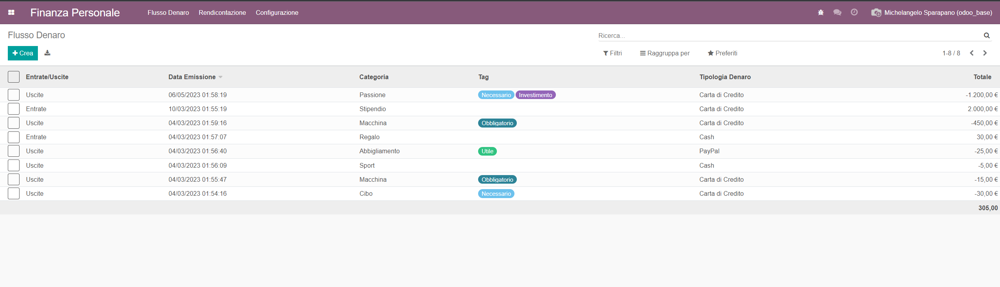
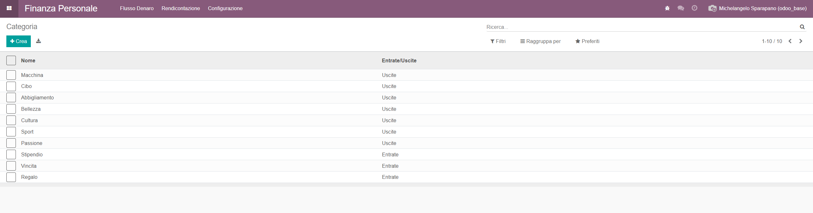
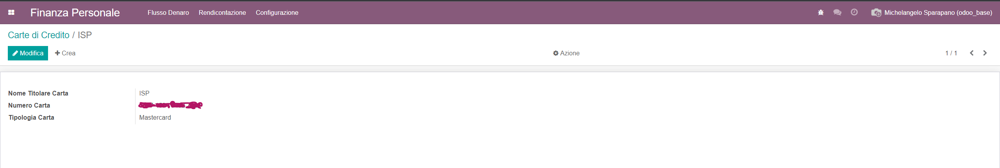

Personal Finance (Odoo module)
================================

This repository contains an Odoo module to help manage personal finances. It provides transaction tracking, categories, tags, credit card support, and basic reports (pivot, graph, list).

Key features
-
- Track income and expenses
- Categorize transactions and add tags
- Configure credit cards and categories
- View reports (pivot, graphs, lists) for review and analysis

Quick usage
-
- Install the `personal_finance` module into your Odoo instance.
- Use the "Money Flow" menu to create transactions and manage categories/tags/credit cards.
- Open the reports to see pivot tables, charts, and lists of your money flows.

Screenshots
-
Support report types: pivot, graph and list

Where to look in the code
-
- Models: [personal_finance/models](personal_finance/models)
- Views: [personal_finance/views](personal_finance/views)
- Reports: [personal_finance/report](personal_finance/report)

If you want any additional text, more images, or a different layout, tell me which screenshots or wording you'd prefer.